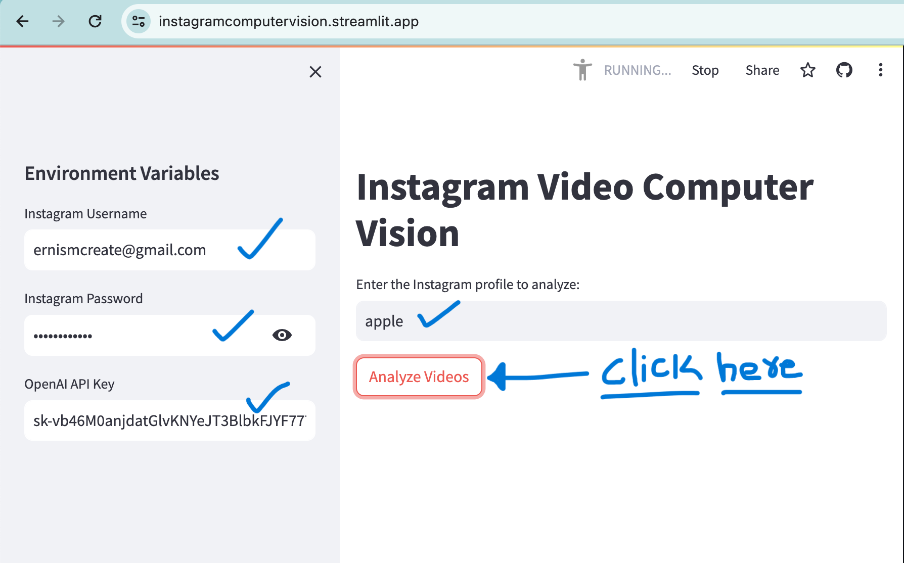
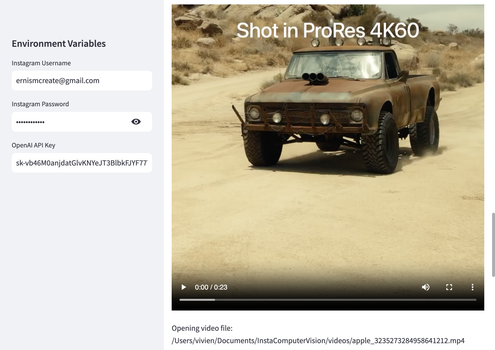
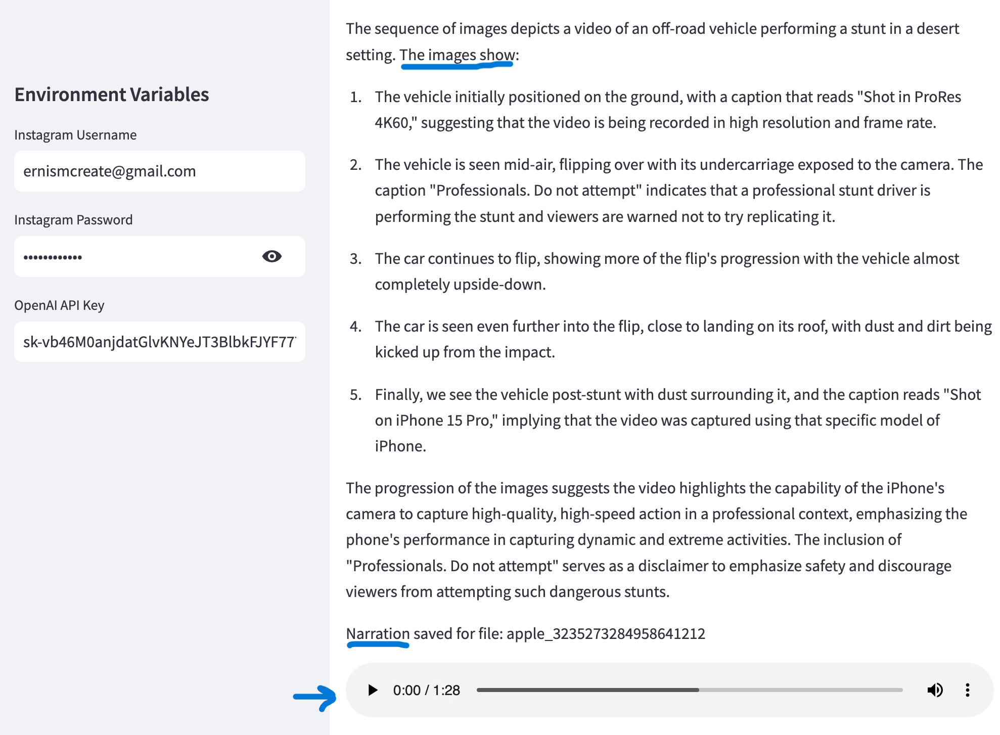
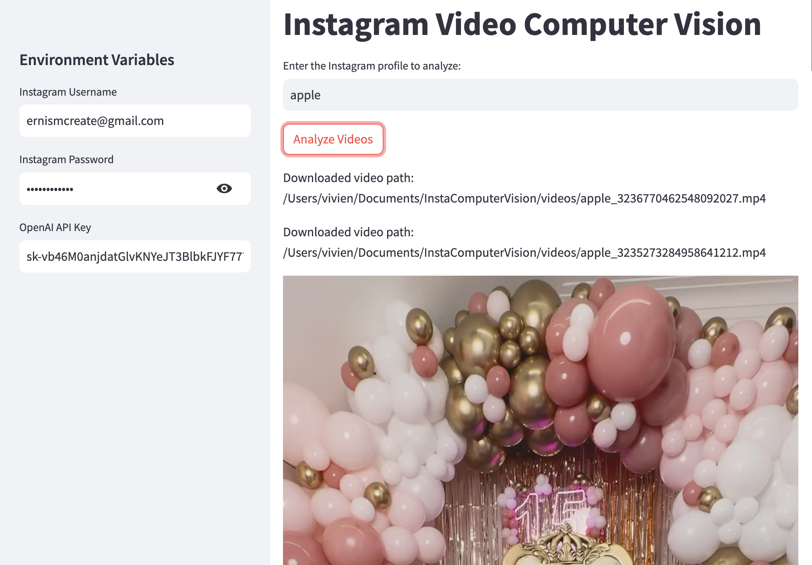
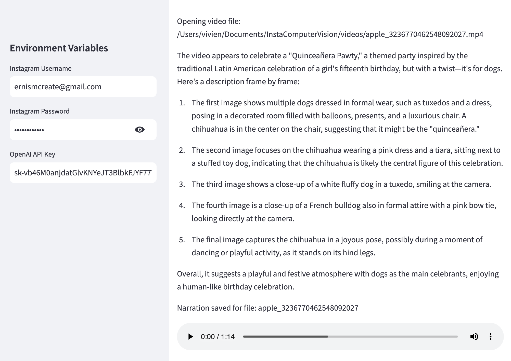

# InstagramComputerVisionAI 

<!-- # Introduction -->

 Wellcome to Instagram Computer Vision AI Based Video Summary Generation Tool! 

<!-- 
There is diverse content on Instagram that people see. It is sometimes very time-consuming to figure out what is in the video. Some people may find it difficult to find out the video insights. Instagram users spend time figuring out what is in the video by watching it even if the video is not of their interest. Some figure out about the video from the comments. Analyzing video insights is one of the challenges people face and wastes a lot of time.

Our solution Instagaram Computer Vision AI solves their problem by generating the text description of the video. So users of Instagram do not need to watch the video to get insights instead they can read the description of the video. We have also provided the audio of the description of the video insights so that if some users are not comfortable reading they can listen to the audio without watching the video to get the insights of the video.
 -->

# Features
* User can enter the profile he wants to analyze
* User can analyze the profile by just click of button
* User can delete the all video and audio files using delete button
* Downloads the video from the instagram of enterend profile
* Converts the video into the image frames
* Describes the video in textual form
* Generates the audio of the description of the video
  
# Working
Let's take a tour of InstaComputerVision and see how it works
#### Home

#### Downloaded video of car performing stunt

#### Description of above video 

#### Downloaded video of party

#### Description of above video

#### Our Team

Meet our diverse International team members: 
Team includes 
  <a href="https://www.linkedin.com/in/vivienrichaud/" target="_blank" >Vivien Richaud</a>
  <a href="https://www.linkedin.com/in/inamulrehman/" target="_blank" >Inam ul Rehman</a>
  <a href="https://www.linkedin.com/in/insha-yaqoob-9a8885247/" target="_blank" >Insha Yaqoob</a> and
  <a href="https://www.linkedin.com/in/abubakar-butt-03684a292/" target="_blank" >Abu Bakar</a>

# Demo

  Check out the demo of our application 
  <a href="https://clipchamp.com/watch/A6L2I08Wf0w" target="_blank" >Video Link</a>
  Live App Link
  <a href="https://instagramcomputervision.streamlit.app/" target="_blank" >Instagram Computer Vision AI</a>

# InstagramComputerVisionAI

1. clone the repo and go to the directory
2. pip install -r requirements.txt
3. Rename .env.example to .env and configure your credentials
4. Python3 app.py or Python app.py
